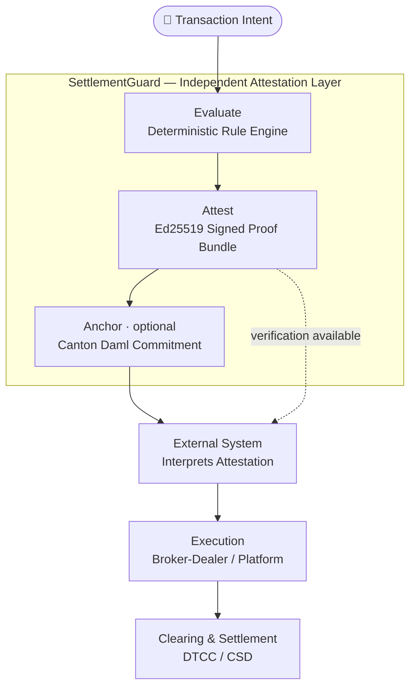
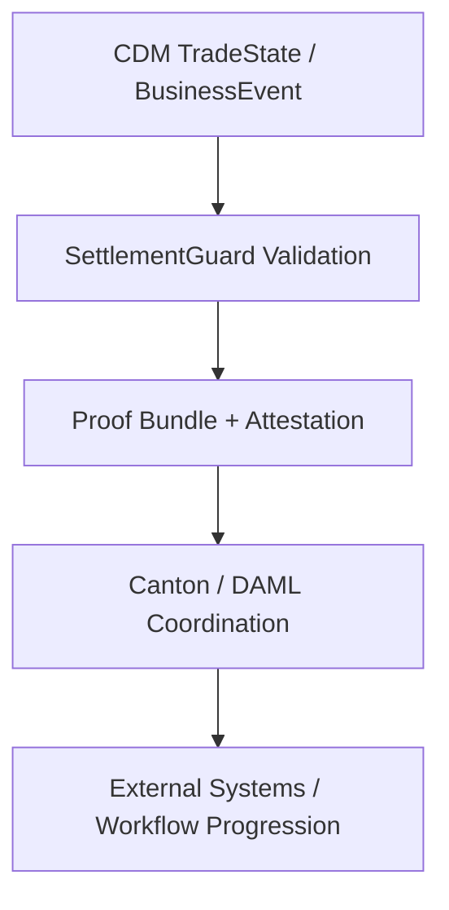
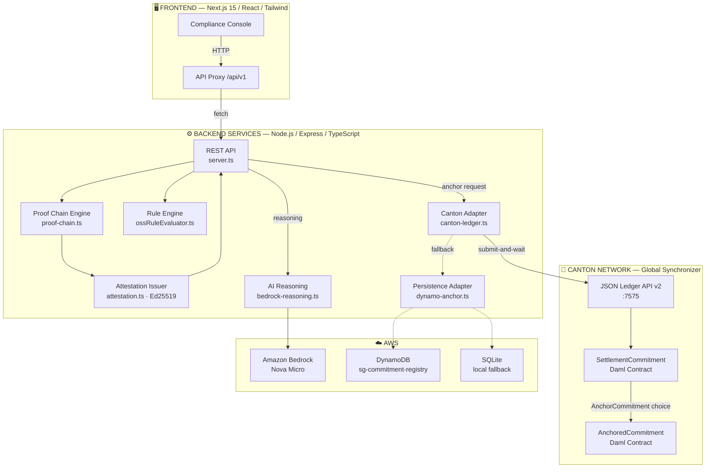
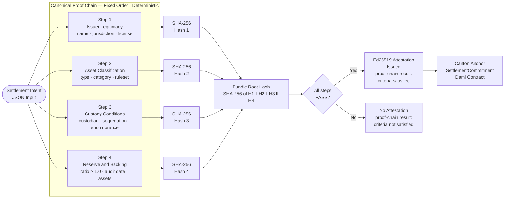
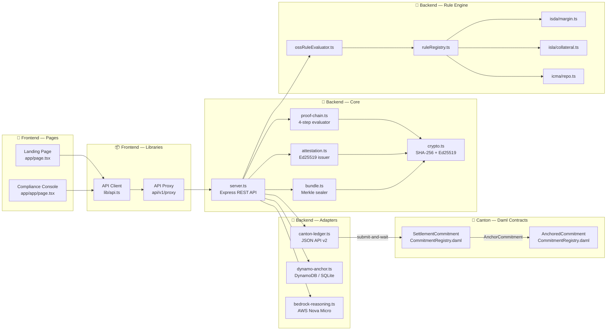

<div align="center">

# CompliLedger — SettlementGuard

### Deterministic Validation &amp; Attestation for CDM-Aligned Tokenized Workflows

[](LICENSE)
[](https://canton.network)
[](https://github.com/finos/common-domain-model)
[](https://github.com/finos-labs)

</div>

---

> **Regulation is shifting from static reporting to real-time, verifiable compliance.**
>
> SettlementGuard introduces a **deterministic validation and attestation layer** for tokenized financial workflows aligned with **CDM lifecycle events**, **ISDA / ISLA / ICMA** market standards, and emerging **digital asset policy frameworks**.

> 🔗 SettlementGuard is actively being explored as a **CDM-aligned validation and attestation pattern** within the [FINOS Common Domain Model](https://github.com/finos/common-domain-model) ecosystem.

---

## What SettlementGuard Is — and Is Not

| | SettlementGuard **is not** | | SettlementGuard **is** |
|---|---|---|---|
| ✕ | An execution system | ✓ | A deterministic validation and attestation layer |
| ✕ | A broker-dealer | ✓ | Aligned to CDM lifecycle events |
| ✕ | A workflow controller | ✓ | A producer of cryptographically verifiable evidence |
| ✕ | A transaction engine | ✓ | External to workflow execution |

---

## Overview

SettlementGuard is a **pre-settlement compliance attestation module** built by CompliLedger.

It evaluates structured transaction inputs against deterministic, machine-readable rule sets (aligned with ISDA, ISLA, and ICMA) and produces **cryptographically verifiable proof artifacts** representing compliance-related conditions at a specific point in time.

> SettlementGuard does not execute transactions, route orders, or make trading decisions.
> It generates independent, tamper-evident attestations and verifiable signals that external systems independently interpret as part of their own workflow continuation.

---

## Non-Intermediary Design

SettlementGuard is explicitly designed as a **non-intermediary system**:

| | Capability |
|---|---|
| ❌ | Does NOT approve or reject transactions |
| ❌ | Does NOT block, permit, or trigger execution |
| ❌ | Does NOT route, match, or sequence orders |
| ❌ | Does NOT custody assets or sign transactions |
| ✅ | Produces independent compliance attestations only |
| ✅ | Operates outside of execution environments |
| ✅ | Outputs verifiable signals, not instructions |

> SettlementGuard outputs are informational and do not constitute transaction instructions or execution logic.

---

## Core Function

For each submitted transaction scenario ("intent"), SettlementGuard:

1. Evaluates inputs against deterministic rule sets
2. Generates a canonical proof bundle (deterministic JSON)
3. Computes a cryptographic hash (SHA-256 / Merkle root)
4. Produces a signed attestation (Ed25519)
5. Enables independent verification of the result
6. Optionally anchors a commitment hash to a ledger (Canton)

Each evaluation produces a **verifiable compliance state**, not an execution decision.

---

## Evaluation Model

SettlementGuard uses deterministic rule evaluation:

| Result | Meaning |
|---|---|
| `PASS` | All evaluated criteria satisfied |
| `FAIL` | One or more criteria not satisfied |
| `CONDITIONAL` | Partial satisfaction; additional review required |

These values represent **rule evaluation results only**. They do not approve, deny, block, or permit transactions, and they do not influence execution.

In API responses, `decision_type: "evaluation"` accompanies OSS rule evaluation responses (`POST /v1/demo/evaluate`) and `decision_type: "enforcement"` accompanies proof-chain responses (`POST /v1/intents`). This separation is intentional.

> **Note on the `"enforcement"` label:** `decision_type: "enforcement"` is an **internal reference implementation label** used to distinguish proof-chain responses from standalone OSS rule evaluation responses. It does **not** mean SettlementGuard authorizes, approves, denies, blocks, permits, or otherwise enforces a transaction. The response is a **proof-chain result** — a verifiable signal that external systems independently interpret. SettlementGuard performs no execution or enforcement action.

---

## Role in the Transaction Lifecycle

SettlementGuard operates **before execution and settlement**, as an independent attestation layer:



SettlementGuard is **not** part of the execution path.

---

## The Gap

The **Common Domain Model (CDM)** standardizes how lifecycle events, trade states, and workflows are represented across capital markets. It provides a shared, machine-readable vocabulary for *what* a financial event is.

What CDM does **not** prescribe is *how* the regulatory and market conditions associated with those events should be **deterministically validated** — and how the resulting evidence should be **cryptographically attested**.

Today:

- ✅ **CDM** standardizes lifecycle events and workflows
- ⚠️ **Validation and attestation** remain fragmented across firms and platforms
- ⚠️ Each participant **implements validation differently**, producing inconsistent results for the same event
- ⚠️ Evidence is often **generated after execution**, as audit reconstruction rather than as a precondition
- ⚠️ Tokenized markets — where workflows are programmable and atomic — require **deterministic validation** and **independently verifiable evidence** *before* state progression

> SettlementGuard explores how **regulatory and market conditions associated with CDM-defined events** can be evaluated **deterministically** and transformed into **cryptographically verifiable proof artifacts** *before* workflow progression.

---

## Why This Matters

Tokenized and programmable markets fundamentally change the role of validation. When settlement is instant, atomic, and machine-coordinated, post-hoc reconciliation is no longer sufficient. Validation must be:

- **Deterministic** — identical inputs must yield identical outcomes, every time, on every implementation
- **Interoperable** — rule evaluation must be portable across participants, venues, and infrastructure
- **Reproducible** — outcomes must be re-derivable from the same inputs at any future point in time
- **Independently verifiable** — third parties must be able to validate evidence without re-running or trusting the issuer

SettlementGuard is **complementary to CDM-defined workflows**: CDM describes *what* the lifecycle event is; SettlementGuard provides a uniform, deterministic way to evaluate the conditions surrounding that event and emit cryptographic evidence that any party — issuer, custodian, regulator, counterparty — can verify independently.

---

## CDM-Aligned Architecture

SettlementGuard is positioned as a **modular, workflow-independent layer** that sits alongside CDM and Canton / DAML, not inside them.

| Layer | Responsibility |
|---|---|
| **CDM** | Standardized lifecycle and workflow representation |
| **SettlementGuard** | Deterministic validation and attestation |
| **Canton / DAML** | Workflow coordination, synchronization, and optional anchoring |

Key architectural properties:

- **Modularity** — validation logic is decoupled from workflow orchestration; rule packs evolve independently of contract code
- **Workflow independence** — SettlementGuard never authors, advances, or blocks a workflow; it observes inputs and emits evidence
- **Deterministic evaluation behavior** — given identical CDM-aligned inputs, the engine always produces the same proof bundle and the same attestation hash



---

## System Architecture



### Architecture Highlights

- **Deterministic rule evaluation engine** — same inputs always produce the same result
- **Canonical proof bundle generation** — deterministic JSON, SHA-256 Merkle root
- **Cryptographic attestation** — Ed25519 signature over bundle root hash
- **Independent verification flow** — any party can verify without re-running evaluation
- **Optional ledger anchoring** — Canton JSON Ledger API v2 (`SettlementCommitment` Daml contract)
- **Optional AI reasoning** — non-deterministic, non-decisional, does not affect attestation
- **REST API** — standard HTTP integration

### Technology Stack

| Layer | Technology | Purpose |
|---|---|---|
| **Commitment Rail** | Canton Network — Daml contracts | On-ledger commitment anchoring and lookup |
| **Backend** | Node.js / Express / TypeScript | Proof chain, attestation, Canton + DynamoDB adapter |
| **AI Reasoning** | AWS Bedrock — Amazon Nova Micro | Optional natural-language compliance explanation |
| **Cryptography** | SHA-256 + Ed25519 | Bundle hashing and attestation signing |
| **Frontend** | Next.js 15 / React / Tailwind CSS | Compliance console with real-time network status |
| **Deployment** | AWS ECS (backend) + Vercel (frontend) | Production infrastructure |

---

## Alignment with Industry Standards

SettlementGuard rule packs align with established market and regulatory standards. These standards define **market conditions**, not execution behavior — SettlementGuard encodes them as deterministic evaluation logic so the same condition is interpreted consistently across participants.

| Standard / Framework | Example Validation Scope | Reference Rule Pack | OSS Demo Status |
|---|---|---|---|
| **ISDA** | Margin sufficiency, counterparty validation | `ISDA_MARGIN_SUFFICIENCY` | Implemented in OSS demo (`rule_pack: "ISDA"`) |
| **ISLA** | Collateral eligibility and coverage | `ISLA_COLLATERAL_COVERAGE` | Implemented in OSS demo (`rule_pack: "ISLA"`) |
| **ICMA** | Repo collateral, haircut, maturity validation | `ICMA_REPO_COLLATERAL_SUFFICIENCY` | Implemented in OSS demo (`rule_pack: "ICMA"`) |
| **GENIUS / CLARITY** | Reserve sufficiency, issuer conditions, asset classification | *(canonical proof-chain / policy-layer framing)* | Not available in `POST /v1/demo/evaluate` — represented in the canonical proof-chain reason-code framing and roadmap, not as an OSS demo rule pack |

> These are **reference snippets only** — they demonstrate how standards-aligned validation can be encoded deterministically, not full legal or production-grade rule packs. Advanced rule orchestration, commercial logic, and full standards compliance remain out of scope for the open-source layer.
>
> The current OSS demo rule packs exposed via `POST /v1/demo/evaluate` are **ISDA**, **ISLA**, and **ICMA**. **GENIUS** and **CLARITY** are referenced as policy-layer framing for the canonical proof chain and roadmap; they are not implemented as standalone OSS demo rule packs in this repository.

---

## Settlement User Flow

End-to-end lifecycle from intent submission through proof evaluation, on-chain anchoring, optional AI reasoning, and independent verification.

```mermaid
sequenceDiagram
    autonumber
    participant U as 👤 User
    participant FE as 🖥️ Frontend
    participant API as ⚙️ Backend API
    participant PC as Proof Chain
    participant AT as Attestation
    participant CL as Canton Ledger
    participant AI as Bedrock AI

    rect rgb(20, 45, 90)
        Note over U,AT: PHASE 1 — INTENT SUBMISSION
        U->>FE: Submit transaction scenario
        FE->>API: POST /v1/intents
        API->>PC: Execute 4-step proof chain
        PC->>PC: Step 1 · Issuer Legitimacy
        PC->>PC: Step 2 · Asset Classification
        PC->>PC: Step 3 · Custody Conditions
        PC->>PC: Step 4 · Reserve and Backing
        PC-->>API: 4 proof steps + SHA-256 hashes
        API->>AT: Seal bundle — Merkle root
        AT->>AT: Sign with Ed25519
        AT-->>API: Signed attestation
        API-->>FE: decision + attestation + bundle_root_hash
        FE-->>U: Compliance result displayed
    end

    rect rgb(20, 80, 45)
        Note over U,CL: PHASE 2 — CANTON ANCHORING  (only when criteria satisfied)
        U->>FE: Click Anchor Commitment
        FE->>API: POST /v1/attestations/:id/anchor
        API->>CL: POST /v2/commands/submit-and-wait
        Note right of CL: Creates SettlementCommitment Daml contract
        CL-->>API: transaction_id + contract_id
        API-->>FE: Canton commitment confirmed
        FE-->>U: On-chain attestation hash returned
    end

    rect rgb(70, 30, 70)
        Note over U,AI: PHASE 3 — AI REASONING  (optional)
        U->>FE: Request explanation
        FE->>API: POST /v1/reasoning/:id
        API->>AI: Invoke Nova Micro
        AI-->>API: Natural-language compliance analysis
        API-->>FE: Reasoning text
        FE-->>U: Plain-language explanation
    end

    rect rgb(70, 50, 10)
        Note over U,CL: PHASE 4 — INDEPENDENT VERIFICATION
        U->>API: POST /v1/verify
        API->>API: Verify Ed25519 signature
        API->>CL: GET /v1/canton/commitments/:hash
        CL-->>API: On-chain contract record
        API-->>U: Verification result — valid or invalid
    end
```



---

## Canonical Proof Chain

| Step | Check | Key Inputs |
|---|---|---|
| 1 | **Issuer Legitimacy** | Issuer name, jurisdiction, license status |
| 2 | **Asset Classification** | Asset type, regulatory category, ruleset |
| 3 | **Custody Conditions** | Custodian, segregation status, encumbrance |
| 4 | **Reserve & Backing** | Reserve ratio (must be ≥ 1.0), audit date, backing assets |

Each step produces a SHA-256 hash of its normalized inputs. The chain never changes order and produces reproducible, independently verifiable results.



---

## Cryptographic Design

- **Bundle Root Hash** — SHA-256 over concatenated proof step hashes
- **Attestation Signature** — Ed25519 over `{bundle_root_hash}:{intent_id}:{issued_at}`
- **On-ledger Contract** — Canton `contractId` and `transaction_id` for `SettlementCommitment` / `AnchoredCommitment` records
- **Privacy** — only hashes committed on-chain; raw settlement data never leaves the originating environment

---

## Deterministic Evaluation

> **`same input → same output → same proof`**

Determinism is the foundational property of SettlementGuard. Every rule evaluation is a pure function of its declared inputs and a versioned, machine-readable rule pack. There is no hidden state, no model inference, and no time-dependent behavior in the evaluation path.

This produces four properties that matter for tokenized financial infrastructure:

- **Reproducible validation** — any party, at any time, can re-run the evaluation against the same inputs and obtain the same proof bundle and the same root hash
- **Interoperability** — because evaluation is fully specified, results are portable across implementations, vendors, and venues
- **Reduced interpretation variance** — the same regulatory or market condition is evaluated identically across participants, eliminating per-firm interpretation drift
- **Independent verification** — third parties can verify the cryptographic attestation without trusting, contacting, or re-executing the issuer

Determinism is what makes SettlementGuard suitable as a **shared validation primitive** for CDM-aligned workflows.

---

## API Reference

| Endpoint | Method | Description |
|---|---|---|
| `/health` | GET | Backend health check |
| `/v1/intents` | POST | Submit a settlement intent for proof evaluation |
| `/v1/intents` | GET | List persisted intent records |
| `/v1/intents/:id` | GET | Fetch a specific intent record |
| `/v1/intents/preset/:presetId` | POST | Run a predefined settlement scenario |
| `/v1/verify` | POST | Verify attestation signature and optional on-chain presence |
| `/v1/attestations/:id/anchor` | POST | Anchor an attestation commitment to Canton |
| `/v1/reasoning/:id` | POST | Generate Bedrock-backed compliance reasoning for an intent |
| `/v1/presets` | GET | List available demo presets |
| `/v1/public-key` | GET | Fetch the active public verification key and metadata |
| `/v1/canton/status` | GET | Canton network / configuration status |
| `/v1/canton/commitments/:attestationHash` | GET | Lookup a commitment by attestation hash |
| `/v1/demo/evaluate` | POST | Evaluate an OSS rule pack independently of the proof chain |

### Example Flow

```bash
# 1. Submit a settlement intent
POST /v1/intents
→ evaluate rule pack
→ generate proof bundle (SHA-256 Merkle root)
→ sign attestation (Ed25519)
→ return result with decision and signed attestation

# 2. Verify independently
POST /v1/verify
→ validate Ed25519 signature
→ validate bundle integrity

# 3. Anchor to Canton (optional, only when proof-chain criteria are satisfied)
POST /v1/attestations/:id/anchor
→ submit SettlementCommitment Daml contract
→ return canton transaction_id and contract_id
```

---

## Demo Rule Pack API

`POST /v1/demo/evaluate` provides a standalone entry point for testing OSS rule snippets without submitting a full intent.

```json
{ "rule_pack": "ISDA | ISLA | ICMA", "payload": { ... } }
```

**ISDA — margin sufficiency** (`examples/isda-margin.json`)
```json
{ "rule_pack": "ISDA", "payload": { "required_margin": 100000, "posted_collateral_value": 110000 } }
```

**ISLA — collateral coverage** (`examples/isla-collateral.json`)
```json
{ "rule_pack": "ISLA", "payload": { "collateral_value": 1050000, "loan_value": 1000000, "haircut": 0.02 } }
```

**ICMA — repo collateral sufficiency** (`examples/icma-repo.json`)
```json
{ "rule_pack": "ICMA", "payload": { "purchase_price": 1000000, "collateral_value": 1050000, "haircut": 0.02 } }
```

A passing evaluation returns `"decision": "PASS"` with an empty `reason_codes` array. A failing evaluation returns `"decision": "FAIL"` or `"CONDITIONAL"` with one or more reason codes.

---

## Example Scenarios

| Scenario | Asset | Attestation | Commitment | Reason |
|---|---|---|---|---|
| **Stablecoin PASS** | USDX-002 | Issued | Anchored | Reserve ratio 1.02 ≥ 1.0, custody valid |
| **Treasury PASS** | USTB-2026-002 | Issued | Anchored | CUSIP verified, position available |
| **Stablecoin FAIL** | USDX-001 | Not issued | Not anchored | Reserve ratio 0.97 < 1.0 threshold |
| **Treasury FAIL** | USTB-2026-001 | Not issued | Not anchored | Custody position flagged invalid |

---

## Canton Integration

SettlementGuard anchors compliance commitments to Canton using Daml contracts defined in `canton/daml/SettlementGuard/CommitmentRegistry.daml`. The backend calls the Canton JSON Ledger API v2.

- **Submit** — `POST /v2/commands/submit-and-wait` creates a `SettlementCommitment` contract
- **Lookup** — `POST /v2/state/active-contracts` queries active commitments by attestation hash
- **Status** — `GET /livez` and `GET /v2/state/ledger-end` for health and ledger offset

### Canton Environment Variables

| Variable | Description |
|---|---|
| `CANTON_LEDGER_API_URL` | Canton JSON API base URL (default: `http://localhost:7575`) |
| `CANTON_SUBMITTER_PARTY` | Submitter party ID (from `canton/setup-canton.sh`) |
| `CANTON_CUSTODIAN_PARTY` | Custodian party ID (from `canton/setup-canton.sh`) |
| `CANTON_PACKAGE_ID` | DAR package hash (from `canton/setup-canton.sh`) |

If these are not set, anchoring falls back to DynamoDB / SQLite for local operation.

### Canton Commitment Lifecycle

```mermaid
stateDiagram-v2
    direction LR
    [*] --> IntentSubmitted : POST /v1/intents

    IntentSubmitted --> ProofChainRunning : Proof chain executes
    ProofChainRunning --> BundleSealed : 4 steps evaluated + hashed
    BundleSealed --> AttestationIssued : criteria satisfied
    BundleSealed --> Denied : criteria not satisfied

    AttestationIssued --> AnchorPending : POST /v1/attestations/:id/anchor
    AnchorPending --> SettlementCommitment : Canton submit-and-wait OK
    SettlementCommitment --> AnchoredCommitment : AnchorCommitment choice custodian co-signs
    AnchoredCommitment --> Verified : POST /v1/verify or GET /canton/commitments/:hash

    AnchorPending --> DynamoFallback : Canton unavailable
    DynamoFallback --> Verified : DynamoDB lookup

    Denied --> [*]
    Verified --> [*]
```



### Local Dev Option A — DPM Sandbox

Prereqs: JDK 17+, DPM (`curl https://get.digitalasset.com/install/install.sh | sh`, then `export PATH="$HOME/.dpm/bin:$PATH"`).

```bash
# Build the Daml DAR
cd canton && dpm build

# Start the Canton sandbox (JSON API on :7575, gRPC on :6866)
dpm sandbox &

# Provision parties, upload DAR, write backend/.env.canton
chmod +x setup-canton.sh && ./setup-canton.sh

# Source env and start backend
set -a && source ../backend/.env.canton && set +a
cd ../backend && npm run dev

# Run end-to-end tests
API_BEARER_TOKEN=... node backend/scripts/e2e-test.mjs http://localhost:3001
```

### Local Dev Option B — CN Quickstart LocalNet

For a full multi-participant network with wallet and scan UIs:

```bash
git clone https://github.com/digital-asset/cn-quickstart
cd cn-quickstart
make install && make start
```

JSON Ledger API: `http://json-ledger-api.localhost` (port 7575 on some builds).
Set `CANTON_LEDGER_API_URL=http://json-ledger-api.localhost` and run the provision/backend steps above.

---

## Running Locally

### Backend

```bash
cd backend
npm install
npm run build
npm start          # http://localhost:3001
```

Required environment variables (see `.env.example`):

```env
SG_SIGNING_SEED_B64=your_base64_32_byte_seed
SG_KEY_ID=sg-demo-key-01
SG_KEY_VERSION=v1
API_BEARER_TOKEN=shared_demo_token
JSON_BODY_LIMIT=32kb
POST_RATE_LIMIT_MAX=60
AWS_REGION=us-east-2
AWS_ACCESS_KEY_ID=your_key
AWS_SECRET_ACCESS_KEY=your_secret
BEDROCK_MODEL_ID=us.amazon.nova-micro-v1:0

# Canton JSON Ledger API (set after running canton/setup-canton.sh)
CANTON_LEDGER_API_URL=http://localhost:7575
CANTON_SUBMITTER_PARTY=
CANTON_CUSTODIAN_PARTY=
CANTON_PACKAGE_ID=
CANTON_DOMAIN=global-synchronizer.canton.network
CANTON_PARTICIPANT=sg-participant-01
DYNAMO_TABLE=sg-commitment-registry
```

### Authentication & route scopes

The backend supports two authentication modes (configure at least one):

- **Static bearer token** (`API_BEARER_TOKEN`) — intended for local development and the demo. Clients sending `Authorization: Bearer $API_BEARER_TOKEN` are granted the `sg:admin` wildcard scope, which satisfies every per-route scope check. This preserves backward compatibility — existing demo clients require **no scope claims**.
- **JWT** (`SG_JWT_SECRET`, `SG_JWT_ISSUER`, `SG_JWT_AUDIENCE`) — for non-demo deployments. Tokens must carry a `scope` (or `scopes`) claim with the per-route scope listed below (or `sg:admin`).

Required scopes per route (enforced by `requireScope` in `backend/src/middleware/auth.ts`):

| Method & path | Required scope |
|---|---|
| `POST /v1/intents`, `POST /v1/intents/preset/:presetId` | `sg:intents:write` |
| `GET  /v1/intents`, `GET /v1/intents/:id` | `sg:intents:read` |
| `POST /v1/verify` | `sg:verify:read` |
| `POST /v1/attestations/:id/anchor` | `sg:attestations:write` (alias: `sg:anchor:write`) |
| `POST /v1/reasoning/:id` | `sg:reasoning:read` |
| `GET  /v1/audit/:id` | `sg:audit:read` |
| `POST /v1/demo/evaluate` | `sg:demo:evaluate` |

`sg:admin` satisfies any required scope.

### Frontend

```bash
cd frontend
npm install
BACKEND_API_URL=http://localhost:3001 npm run dev
# Opens at http://localhost:3000
```

---

## Project Structure

```
dtcch-2026-compliledger/
├── backend/
│   └── src/
│       ├── server.ts                # Express API — all REST endpoints
│       ├── canton-ledger.ts         # Canton JSON Ledger API v2 integration
│       ├── proof-chain.ts           # 4-step canonical proof chain
│       ├── attestation.ts           # Ed25519 attestation issuance
│       ├── bundle.ts                # Proof bundle sealing
│       ├── crypto.ts                # SHA-256 + Ed25519 utilities
│       ├── bedrock-reasoning.ts     # AWS Bedrock Nova Micro AI reasoning
│       ├── dynamo-anchor.ts         # DynamoDB / SQLite fallback persistence
│       ├── db.ts                    # SQLite intent persistence
│       ├── types.ts                 # Shared type definitions
│       ├── engine/
│       │   ├── ossRuleEvaluator.ts  # OSS rule evaluation entry point
│       │   └── ruleRegistry.ts      # Rule pack registry (ISDA, ISLA, ICMA)
│       └── rules/
│           ├── isda/margin.ts       # ISDA margin sufficiency snippet
│           ├── isla/collateral.ts   # ISLA collateral coverage snippet
│           └── icma/repo.ts         # ICMA repo collateral sufficiency snippet
├── canton/
│   ├── daml.yaml                    # DPM project config (SDK 3.4.11)
│   ├── setup-canton.sh              # Provision parties + upload DAR + write .env.canton
│   ├── README.md                    # Canton-specific setup and LocalNet guide
│   └── daml/SettlementGuard/
│       └── CommitmentRegistry.daml  # SettlementCommitment + AnchoredCommitment templates
├── frontend/
│   ├── app/
│   │   ├── page.tsx                 # Landing page
│   │   ├── app/page.tsx             # Compliance console
│   │   └── api/v1/[...path]/        # Server-side API proxy
│   └── lib/
│       └── api.ts                   # API client
├── examples/
│   ├── isda-margin.json             # ISDA margin check example payload
│   ├── isla-collateral.json         # ISLA collateral coverage example payload
│   └── icma-repo.json               # ICMA repo check example payload
├── .env.example                     # Environment variable template
└── README.md
```

---

## Component Architecture



---

## Optional AI-Assisted Reasoning

SettlementGuard can optionally generate AI-assisted explanations via `POST /v1/reasoning/:id` (AWS Bedrock, Amazon Nova Micro). This capability exists purely to translate deterministic evaluation results into plain-language commentary for human reviewers.

- **Informational only** — AI output is commentary, never a decision
- **Non-deterministic** — model output may vary across invocations
- **Not part of proof generation** — AI text is excluded from the proof bundle, the bundle root hash, and the Ed25519 attestation
- It does not affect evaluation results, attestation values, or on-chain commitments
- Requires valid AWS credentials and Bedrock model access

> The deterministic proof chain is the source of truth. AI-assisted reasoning is a presentation aid layered on top of it.

---

## FINOS / CDM Contribution

> SettlementGuard is currently being explored as a **proposed deterministic validation and attestation pattern** aligned to CDM lifecycle events within the [FINOS Common Domain Model](https://github.com/finos/common-domain-model) ecosystem.

Discussion and design proposal:
🔗 [finos/common-domain-model#4684](https://github.com/finos/common-domain-model/issues/4684)

The intent is to contribute SettlementGuard's evaluation and attestation pattern as a reusable, standards-aligned building block that complements CDM's lifecycle and workflow representations — enabling the broader ecosystem to share a consistent approach to deterministic validation and verifiable evidence for tokenized financial infrastructure.

---

## Contributing

All FINOS Hackathon projects are [Apache 2.0 licensed](LICENSE) and accept contributions via GitHub pull requests.

Each commit must include a DCO sign-off:

```
Signed-off-by: Your Name <you@compliledger.com>
```

```bash
git config user.name "Your Name"
git config user.email "you@compliledger.com"
git commit -s -m "your commit message"
```

---

## Disclaimer

This repository is a **reference implementation** intended for demonstration and development purposes.

- Security controls are simplified
- Key management is not production-grade
- Execution systems are not included
- Rule packs are illustrative reference snippets, not legal compliance engines

Production deployments should include:

- Secure key management (KMS / HSM)
- Authentication and authorization controls
- Transactional persistence and audit logging
- Infrastructure hardening and network isolation
- Legal review of rule pack alignment with applicable regulations

---

## License

[Apache 2.0](LICENSE)

---

## Team

**CompliLedger** — Innovate.DTCC Hackathon 2026
Presented in the **Regulatory Compliance & Governance** track
Slot: 11:25–11:40am ET
