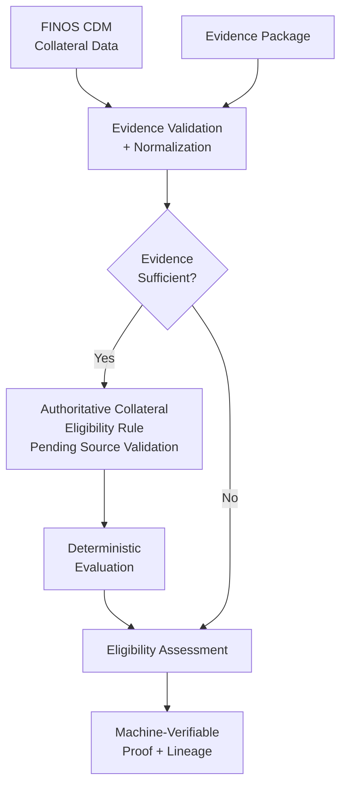

<div align="center">

# CompliOpen

### Evidence-Backed Deterministic Evaluation &amp; Machine-Verifiable Proof for FINOS CDM

[](LICENSE)
[](https://canton.network)
[](https://github.com/finos/common-domain-model)
[](https://github.com/finos-labs)

</div>

CompliOpen is CompliLedger's open-source implementation and contribution surface for deterministic, evidence-backed governance evaluation and machine-verifiable proof. The current FINOS/CDM use case being explored is **evidence-backed collateral eligibility using the FINOS Common Domain Model**. The authoritative requirement and source validation for that contribution are still pending.

The intended conceptual chain is:

```text
CDM collateral data → evidence → evidence validation and normalization
→ authoritative eligibility rule → deterministic evaluation
→ assessment → proof
```

This repository originated as SettlementGuard, CompliLedger's Innovate.DTCC 2026 hackathon project. Its existing reference rules, proof chain, Canton/Daml integration, cryptographic attestation, and demo UI remain available as historical and reference implementations. They are not silently reclassified as the current FINOS contribution. See [`docs/RENAME.md`](docs/RENAME.md) for retained compatibility identifiers.

## Current FINOS/CDM Focus — Evidence-Backed Collateral Eligibility

CDM represents business data and provides eligibility functionality and modeling capabilities. A CDM function or model reference is not, by itself, proof of an authoritative regulatory requirement for this contribution.

The proposed flow is intended to answer questions such as:

- Which collateral facts are being evaluated?
- What evidence supports each fact?
- Is the evidence valid, fresh, sufficient, and non-conflicting?
- Which authoritative requirement applies?
- What exact rule and version were used?
- Was the result produced deterministically?
- Can an independent party verify the inputs, lineage, versions, and assessment?

These are design questions and direction, not claims that the new scaffold already verifies evidence freshness or authenticity.


```mermaid
flowchart TD
    CDM["FINOS CDM\nCollateral Data"]
    EVID["Evidence Package"]
    VALID["Evidence Validation\n+ Normalization"]
    GATE{"Evidence\nSufficient?"}
    RULE["Authoritative Collateral\nEligibility Rule\nPending Source Validation"]
    EVAL["Deterministic\nEvaluation"]
    ASSESS["Eligibility Assessment"]
    PROOF["Machine-Verifiable\nProof + Lineage"]
    CDM --> VALID
    EVID --> VALID
    VALID --> GATE
    GATE -->|Yes| RULE
    RULE --> EVAL
    EVAL --> ASSESS
    ASSESS --> PROOF
    GATE -->|No| ASSESS
```

> **The authoritative collateral-eligibility requirement for this FINOS CDM contribution has not yet been finalized. CompliOpen does not infer or invent eligibility criteria and does not substitute the repository’s existing ISDA, ISLA, or ICMA reference rules for the future authoritative rule.**

The diagram is conceptual. Sufficient evidence does **not** bypass the absent-authority gate or yield an eligibility determination.

> **The authoritative collateral-eligibility requirement for this FINOS CDM contribution is pending source validation. No production eligibility determination should be made from the placeholder implementation.**

There are two intentionally separate CDM paths:

| Path | Current status |
|---|---|
| Existing `backend/src/cdm/` provider boundary | Optional legacy API integration that validates and gates evidence before calling a configured provider. |
| New `backend/src/contributions/finosCdm/collateralEligibility/` | Isolated contribution flow with caller-supplied, unvalidated mappings and evidence, a guarded versioned-rule boundary, assessment, unsigned proof, and replay verification. No authoritative rule is installed. |

## What CompliOpen Is

CompliOpen is:

- An open-source deterministic governance and evaluation implementation.
- An evidence-backed assessment pattern that can consume CDM-aligned data.
- A place to preserve provenance and produce machine-verifiable artifacts.
- Deterministic where objective, versioned rules and trusted inputs are available.
- Independently verifiable within the limits described in [Proof / Verification](#proof--verification).
- Non-executing and external to transaction, settlement, and workflow control.

CompliOpen is **not**:

- FINOS CDM itself or an authoritative ISDA, ISLA, or ICMA source.
- A legal interpretation engine, broker-dealer, trading system, or transaction execution engine.
- A substitute for legal or regulatory interpretation.
- An AI eligibility decision system. AI may provide an optional explanation only; it never determines eligibility.

An integrity hash or replay result shows consistency of a supplied record and pipeline. It does not prove that facts, evidence, mappings, source authority, or legal conclusions are authentic or current.

## Collateral Eligibility Architecture

The target architecture is:


```mermaid
flowchart LR
    CDM["CDM collateral data"]
    SOURCES["Evidence sources"]
    ADAPTER["CDM / evidence adapter"]
    VALIDATE["Evidence validation"]
    NORMALIZE["Normalization"]
    SUFF["Evidence sufficiency"]
    AUTH["Authoritative rule boundary\nsource validation pending"]
    EVAL["Deterministic evaluation"]
    ASSESS["Assessment"]
    PROOF["Unsigned proof artifact"]
    VERIFY["Independent verification"]
    ATTEST["Optional cryptographic attestation"]
    CANTON["Optional Canton commitment"]
    NDET["Absent authority:\nnon-determination"]
    EXPLAIN["Optional explanation\n(non-decisional)"]

    CDM --> ADAPTER
    SOURCES --> ADAPTER
    ADAPTER --> VALIDATE --> NORMALIZE --> SUFF --> AUTH
    AUTH --> EVAL --> ASSESS --> PROOF --> VERIFY
    PROOF -. optional extension, not wired .-> ATTEST -. optional extension, not wired .-> CANTON
    ASSESS -. optional explanation only .-> EXPLAIN
    AUTH -. no installed authoritative rule .-> NDET
```

The new contribution's proof flow is local and unsigned. It is not wired to the legacy attestation, Canton, Bedrock, or `/v1/verify` endpoints. The dotted paths are conceptual optional extensions, not implemented connections. The existing provider path and the new contribution path are not interchangeable executable pipelines.

The architectural stages are deliberately explicit:

1. **Governed subject** — a collateral or collateral arrangement represented by a source reference; identity remains unresolved in the new artifact.
2. **Current operational state** — facts and evidence observations captured for an evaluation context.
3. **Applicable requirement** — a future validated collateral-eligibility requirement.
4. **Evidence** — source claims supporting the evaluation.
5. **Evidence validation and normalization** — structural processing whose unresolved authenticity and freshness remain visible.
6. **Deterministic evaluation** — a versioned rule, once one is admitted.
7. **Assessment and decision** — an explicit outcome, including non-determination.
8. **Proof artifact and verification** — a reproducible record of inputs, lineage, versions, context, and result.

## Evidence-Backed Evaluation

The new contribution accepts an adapter envelope, normalized facts, and evidence records. Optional mappings are caller-supplied and explicitly `CALLER_SUPPLIED_UNVALIDATED`; source validation is `PENDING_SOURCE_VALIDATION`. Evidence is structurally classified as `UNVALIDATED` or `INVALID`. Registration of a rule does not validate CDM mappings or evidence.

Evidence sufficiency is a gate in the architecture, not a claim that the repository has established a normative evidence policy for the future rule. An unavailable, malformed, conflicting, or otherwise unverifiable input must not be converted into a positive or negative eligibility result.

## Authoritative Rule Status

The exact source authority, document and version, provision, effective date, jurisdiction, scope, applicability, required inputs, and required evidence are still being identified and reviewed. No existing ISDA, ISLA, or ICMA rule is presented as that authority. The mock provider is never authoritative.

The rule contract can represent `ruleId`, `ruleVersion`, `sourceAuthority`, `sourceDocument`, `sourceProvision`, `effectiveDate`, `jurisdiction`, `scope`, applicability conditions, required inputs, required evidence, reason-code declarations, evaluation callbacks, and provenance. Unknown values remain explicitly unresolved or null. A draft or template cannot be registered as executable; registration requires an exact reviewed metadata snapshot and application-controlled source-review admission. That admission validates structure and matching metadata, not source truth or reviewer authenticity.

Until a validated version is installed, the new evaluator returns:

```text
decision: RULE_NOT_CONFIGURED
reason:   AUTHORITATIVE_RULE_NOT_CONFIGURED
rule:     null
```

Architecture was built before final rule selection so evidence, provenance, deterministic evaluation, assessment, and proof boundaries can evolve independently. Human review is still required to identify the authoritative source, provision, applicability, evidence requirements, and confirmed CDM mappings.

## Assessment Model

### Existing CDM provider assessment

The existing provider path uses these statuses:

| Status | Meaning |
|---|---|
| `SATISFIED` | A configured provider returned a positive result accepted by current response validation. |
| `NOT_SATISFIED` | A configured provider returned an accepted negative result. |
| `NOT_EVALUABLE` | Evidence is missing, invalid, stale, insufficient, or the provider is unavailable, malformed, or unverifiable. |
| `MANUAL_REVIEW` | Evidence conflicts, duplicate IDs, or collateral/specification mismatches require review. |

The legacy bridge maps these to `eligible`, `ineligible`, `indeterminate_missing_evidence`, `indeterminate_conflicting_evidence`, or `technical_error`. Provider outcomes and response verification do not prove that a selected authoritative rule has been validated. They do not mean legal compliance or transaction authorization.

### New contribution assessment

The isolated namespace preserves these decisions:

`RULE_NOT_CONFIGURED`, `SATISFIED`, `NOT_SATISFIED`, `INSUFFICIENT_EVIDENCE`, and `MANUAL_REVIEW_REQUIRED`.

No positive or negative determination is produced without an admitted rule. The new namespace does not claim the existing provider's freshness policy; its source validation, mappings, and evidence remain explicitly unvalidated. Reason codes and fields are retained rather than collapsed or renamed.

## Proof / Verification

`createCollateralEligibilityProof` records a strict JSON snapshot containing a source-reference-only subject, operational state, normalized facts and evidence references, diagnostics, replay inputs, exact context, rule metadata, and assessment. `verifyCollateralEligibilityProof` treats the artifact as untrusted data, checks supported versions and its integrity commitment, and can replay only with a trusted, exact-version registered rule.

The unsigned artifact uses versioned canonical JSON and SHA-256. Object keys are sorted and array order is preserved; unsupported JSON values are rejected. Replay requires the same normalized facts and evidence plus the exact rule, pipeline, mapping, and evaluation-context versions. If the rule is unavailable or authority is not configured, verification can establish record integrity or unavailable replay, not eligibility.

These checks do **not** prove source authenticity, evidence freshness, CDM mapping correctness, legal authority, regulatory compliance, or eligibility. A recomputed hash is not an authenticated origin or external trust anchor. Legacy attestations are different: they use runtime timestamps and external proof-chain services, so no blanket claim that identical inputs always produce an identical attestation hash is made.

## CDM Provider Boundary

The existing `backend/src/cdm/` boundary is an optional assessment added to a legacy sealed bundle when `cdm_eligibility_request` is supplied:

```text
cdm_eligibility_request
 → evidence validation and normalization
 → evidence lineage
 → gated provider
 → normalized assessment
 → fail closed
```

It accepts:

- `collateral_reference`
- `specification`, or `specification_reference` (which requires a resolver)
- `evidence_package` with flat `evidence`
- legacy `query_evidence`

The configured function string is `cdm.product.collateral.CheckEligibilityByDetails`. Local adapter DTOs include `EligibleCollateralSpecification`, `EligibilityQuery`, and `CheckEligibilityResult`. These mappings and provider metadata do not establish a verified FINOS schema or authoritative requirement.

The assessment preserves `assessment_type`, `legacy_status`, `reason_codes`, `evidence_reference_ids`, accepted/rejected/submitted evidence, `query`, `query_hash`, `evidence_lineage_hash`, `evidence_policy`, and nullable provider/model versions. It also retains verification metadata and provider result summaries where available.

### Providers and configuration

`ExternalCdmEligibilityProvider` is used for a configured external endpoint. Responses must pass the implementation's validation and verification checks; unavailable, malformed, or unverified responses fail closed. `MockCdmEligibilityProvider` returns explicitly configured canned fixtures only.

> **TEST / REFERENCE ONLY — NOT AN AUTHORITATIVE ELIGIBILITY ENGINE**

| Variable | Purpose |
|---|---|
| `CDM_ELIGIBILITY_ENDPOINT` | External provider endpoint. |
| `CDM_ELIGIBILITY_AUTH_TOKEN` | Optional provider bearer token. |
| `CDM_ELIGIBILITY_AUTH_HEADER` | Optional provider auth header. |
| `CDM_ELIGIBILITY_TIMEOUT_MS` | External request timeout; default is 8000 ms. |
| `CDM_ELIGIBILITY_PROVIDER_VERSION` | Optional provider version metadata. |
| `CDM_MODEL_VERSION` | Optional CDM model version metadata. |
| `CDM_RESPONSE_HMAC_SECRET` | Required when an external endpoint is configured; supports response verification, not real-world truth or authority. |
| `CDM_ELIGIBILITY_PROVIDER=mock` | Selects the local fixture provider only. |
| `CDM_ELIGIBILITY_MOCK_RESPONSE` | JSON canned `CheckEligibilityResult` fixture. |

## Existing Reference Rules

The original open-source rule implementations remain available and independent:

| Rule family | Reference implementation |
|---|---|
| ISDA | Margin sufficiency and related collateral checks. |
| ISLA | `ISLA_COLLATERAL_COVERAGE` coverage check and the separately documented `ISLA_COLLATERAL_ELIGIBILITY` reference rule where applicable. Coverage is not synonymous with eligibility. |
| ICMA | Repo collateral sufficiency. |

These are deterministic examples from SettlementGuard, not the future authoritative FINOS rule. Existing reason codes, examples, and the legacy `POST /v1/demo/evaluate` request shape remain reference/demo behavior. Verify any sample against the current schema before using it.

```bash
curl -X POST http://localhost:3001/v1/demo/evaluate \
  -H 'Content-Type: application/json' \
  -d '{"rule_id":"ISDA_MARGIN_SUFFICIENCY","inputs":{}}'
```

The demo endpoint and payload above are legacy/reference material; the current FINOS contribution does not expose a replacement HTTP route.

## Original SettlementGuard Reference Implementation

This section retains the historical four-step chain and related artifacts. It is not the current FINOS/CDM model.

### Four-step proof chain

1. **Issuer Legitimacy**
2. **Asset Classification**
3. **Custody Conditions**
4. **Reserve &amp; Backing**

The chain normalizes inputs, hashes each step with SHA-256, seals a canonical bundle, and derives legacy `ALLOW` or `DENY` decision records. Existing `decision_type: "evaluation"` and `decision_type: "enforcement"` labels are preserved where runtime compatibility requires them. The latter is an internal proof-chain label, not authorization to transact or control of settlement.

Historical stablecoin and Treasury scenarios, settlement-intent flows, GENIUS/CLARITY policy framing, and the original component architecture remain reference context. GENIUS and CLARITY are not standalone implemented FINOS demo rule packs here.

### Legacy architecture and optional explanation

The original UI and backend include the proof chain, Ed25519 attestation, optional Canton/Daml anchoring, persistence fallback, and optional Bedrock explanation. Bedrock is outside the deterministic decision path and cannot determine eligibility. CompliOpen does not route, match, custody, approve, reject, block, or permit transactions.

## API Reference

### Legacy HTTP surface

The backend is an Express service. Important legacy routes include:

| Route | Purpose |
|---|---|
| `POST /v1/intents` | Submit a proof-chain intent. |
| `GET /v1/intents/:id` | Read an intent and its bundle. |
| `POST /v1/verify` | Verify a legacy signed proof/attestation. |
| `POST /v1/attestations/:id/anchor` | Optionally anchor an attestation. |
| `POST /v1/reasoning/:id` | Request optional non-decisional explanation. |
| `GET /v1/audit/:id` | Read the audit record. |
| `POST /v1/demo/evaluate` | Evaluate an existing reference rule pack. |
| `GET /v1/canton/status` | Report configured Canton readiness. |

The new collateral-eligibility proof artifact is currently an isolated module API, not an HTTP route and not a `/v1/verify` artifact.

### Authentication and scopes

The legacy API supports a demo bearer token and JWT configuration. Static bearer-token clients receive wildcard `sg:admin`; JWT clients must carry an appropriate scope.

| Scope | Legacy routes |
|---|---|
| `sg:intents:write` | `POST /v1/intents`, preset intent routes |
| `sg:intents:read` | `GET /v1/intents`, `GET /v1/intents/:id` |
| `sg:verify:read` | `POST /v1/verify` |
| `sg:attestations:write` | `POST /v1/attestations/:id/anchor` |
| `sg:anchor:write` | Backward-compatible alias for attestation anchoring |
| `sg:reasoning:read` | `POST /v1/reasoning/:id` |
| `sg:audit:read` | `GET /v1/audit/:id` |
| `sg:demo:evaluate` | `POST /v1/demo/evaluate` |
| `sg:admin` | Wildcard compatibility scope |

See `backend/src/middleware/auth.ts` for enforcement. Do not place deployment secrets in requests or source.

## Canton Integration

Canton/Daml is an optional legacy commitment and anchoring integration, not a requirement for the standalone new contribution. The client uses Canton JSON Ledger API v2, with `SettlementCommitment` and `AnchoredCommitment` contracts under `canton/daml/SettlementGuard/`. LocalNet setup and DAR/package instructions are in [`canton/README.md`](canton/README.md) and [`docs/DEVNET.md`](docs/DEVNET.md).

When a configured ledger is unavailable, the existing commitment registry can fall back to DynamoDB/SQLite. `CANTON_NETWORK_PROFILE=devnet` is informational; DevNet support is not proof of a live deployment. The repository's readiness documentation requires a real validator health check and a successful `SettlementCommitment` round trip before DevNet is called live.

Retained compatibility names include `sg-commitment-registry`, `sg-participant-01`, `canton/daml/SettlementGuard`, and the existing DAR names. They are not renamed by this contribution.

## Running Locally

### Backend

```bash
cd backend
npm install
cp .env.example .env
npm run dev
```

The default backend listens on port `3001`. For a build and the repository's local checks:

```bash
cd backend
npm run build
npm test
```

`npm test` runs the build, Canton status check, CDM provider check, CDM assessment check, and contribution check. Separate scripts cover E2E, CDM integration, Canton readiness, and Canton anchoring smoke tests:

```bash
npm run test:e2e
npm run test:cdm-integration
npm run canton:readiness
npm run canton:anchor-smoke
```

These commands describe repository scripts; no claim is made here that they have been run in every environment.

### Frontend

In a second terminal, start the retained Next.js demo UI:

```bash
cd frontend
npm install
npm run dev
```

The frontend is a legacy/reference console and proxy. It is not required for the isolated contribution flow.

### Canton LocalNet

For the retained Canton/Daml integration, use the documented DPM sandbox path:

```bash
cd canton
dpm build
dpm sandbox &
chmod +x setup-canton.sh
./setup-canton.sh
set -a && source ../backend/.env.canton && set +a
cd ../backend
npm run dev
```

Alternatively, Canton Network's Quickstart LocalNet can provide a JSON Ledger API. See [`canton/README.md`](canton/README.md) for prerequisites, party allocation, DAR upload, and the `http://localhost:7575` / `json-ledger-api.localhost` options. These are legacy optional integrations, not requirements for the new local proof flow.

### Environment

Use [`backend/.env.example`](backend/.env.example) as the source of truth. Relevant retained names include `SG_SIGNING_SEED_B64`, `SG_KEY_ID`, `SG_KEY_VERSION`, `SG_JWT_*`, and `sg:*` scopes. CDM provider variables are listed in [CDM Provider Boundary](#cdm-provider-boundary). AWS and Canton are optional for local legacy features and are not required for the isolated collateral-eligibility flow.

## Project Structure

```text
backend/src/
├── server.ts
├── cdm/                                      # existing provider boundary
├── contributions/finosCdm/collateralEligibility/
│   ├── adapter.ts
│   ├── assessment.ts
│   ├── evaluator.ts
│   ├── evidence.ts
│   ├── proof-artifact.ts
│   ├── registration.ts
│   ├── types.ts
│   └── verification.ts
├── engine/ossRuleEvaluator.ts
├── rules/isda/margin.ts
├── rules/isla/collateral.ts
├── rules/icma/repo.ts
├── proof-chain.ts
├── attestation.ts
├── crypto.ts
├── canton-ledger.ts
└── middleware/auth.ts
canton/
├── daml/SettlementGuard/CommitmentRegistry.daml
├── daml.yaml
└── setup-canton.sh
docs/
├── DEVNET.md
├── RENAME.md
└── openapi.yaml
```

The tree shows the new isolated namespace, existing CDM boundary, and legacy rules without implying that they are one executable pipeline.

## CompliOpen and CompliLedger

CompliOpen is an open-source contribution implementation demonstrating selected deterministic governance, evidence, assessment, and proof patterns. It is **not** the open-source edition of the full CompliLedger commercial platform. No proprietary internals or commercial regulatory content are included.

## FINOS/CDM Contribution

The current direction is evidence-backed collateral eligibility using FINOS CDM, under development and being explored rather than accepted, endorsed, or approved. The related upstream discussion is [FINOS Common Domain Model issue #4684](https://github.com/finos/common-domain-model/issues/4684). This repository does not rewrite that issue's history or claim an upstream decision.

The contribution is intentionally conservative: it provides an adapter boundary, explicit unresolved source/mapping/evidence states, versioned rule metadata, guarded registration, deterministic evaluation plumbing, assessment states, and an unsigned proof/replay API. It does not install a rule or claim that its mappings are validated FINOS schema mappings.

## Contributing

Contributions should keep authoritative-source questions, evidence provenance, and implementation status explicit. In particular:

1. Do not invent eligibility criteria or populate unresolved authority metadata.
2. Keep new contribution code separate from legacy reference rules and provider integrations.
3. Preserve deterministic behavior, exact versions, reason codes, and replay inputs.
4. Do not add AI judgment to the eligibility path.
5. Add tests for changes and run the relevant existing scripts.
6. Do not commit secrets or deployment credentials.
7. Follow the repository's DCO and licensing requirements.

Historical compatibility names and migration context are documented in [`docs/RENAME.md`](docs/RENAME.md); do not rename those identifiers as part of a contribution.

## Disclaimer

CompliOpen output is informational and technical. It is not legal advice, a regulatory determination, a transaction authorization, an execution instruction, or a substitute for professional review. A deterministic result, signature, hash, proof artifact, or provider response does not establish source authority, authenticity, freshness, compliance, or eligibility by itself.

## License

This project is licensed under the [Apache License 2.0](LICENSE). See [`NOTICE`](NOTICE) and repository files for attribution and DCO information.

## Project Origin / Team

### Project Origin — SettlementGuard

CompliOpen originated as SettlementGuard, CompliLedger's Innovate.DTCC 2026 hackathon project. The original project explored deterministic financial rules, canonical bundles, SHA-256, Ed25519 signatures, independent verification, optional Canton/Daml commitments, and reference ISDA/ISLA/ICMA rules. Those capabilities and artifacts remain available while the repository evolves toward the FINOS/CDM contribution described above.

The historical SettlementGuard team, FINOS/DTCC attribution, original schedules, and original artifacts are retained as historical record. They should not be read as a current delivery schedule or as evidence that an authoritative collateral requirement has been selected. See [`docs/RENAME.md`](docs/RENAME.md) and the retained source and archive paths for compatibility details.

### Open questions requiring human review

- Selection and validation of the authoritative collateral-eligibility source and provision.
- External CDM mappings and evidence authenticity/freshness requirements.
- Upstream FINOS acceptance or endorsement of the contribution direction.
- Live DevNet, validator, deployment, and operational status.
- Historical context not independently verified in this repository.
